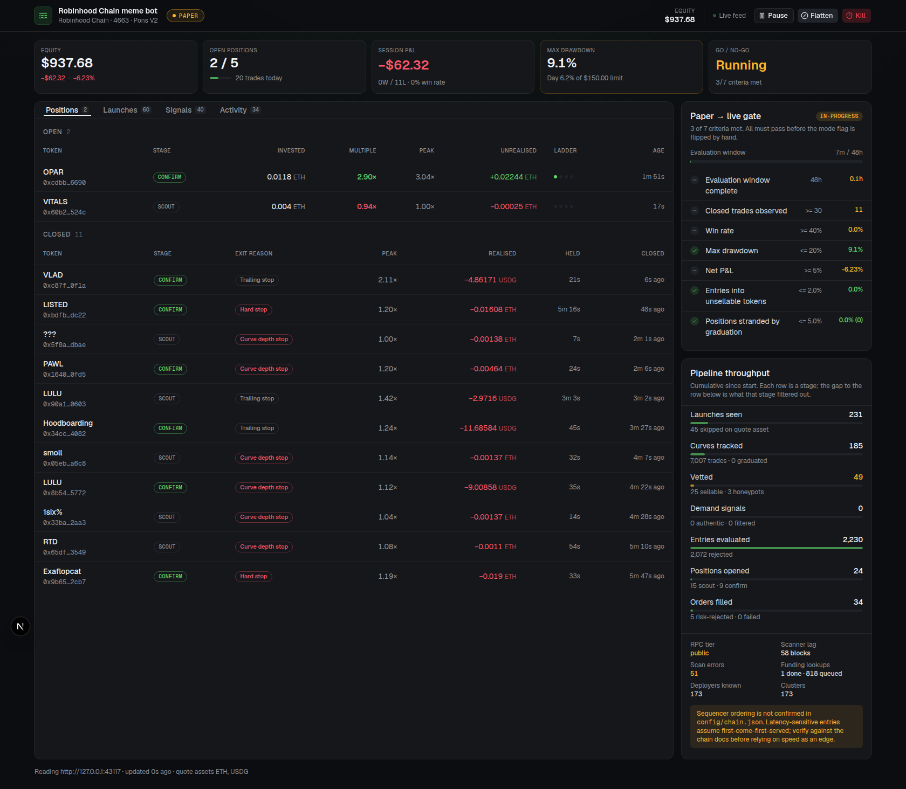

# Robinhood Chain meme-coin bot

An event-driven trading bot for [Pons V2](https://docs.ponsfamily.com/v2) bonding-curve
launches on Robinhood Chain (chain ID 4663), with an operator dashboard.

It watches the Pons factory for new launches, checks each token is actually sellable,
scores the wallet that deployed it, decides whether the demand around it is real or
manufactured, sizes a position on the combined confidence, and manages the exit against
curve depth rather than a flat percentage.

**It ships in paper mode and stays there until you change that by hand.** Paper mode
reads real mainnet state and prices real fills against real reserves — it simply never
signs a transaction. See [Paper mode, and going live](#paper-mode-and-going-live).

---

## Quick start

Requires **Node 22+** (the storage layer uses the built-in `node:sqlite`).

```bash
npm install
npm run dev
```

That starts both processes:

| Process   | URL                     | What it is                     |
| --------- | ----------------------- | ------------------------------ |
| Bot       | `http://127.0.0.1:43117` | Trading engine + operator API |
| Dashboard | `http://127.0.0.1:43118` | Operator console              |

No configuration and no API keys are needed to run in paper mode. It connects to the
public RPC, starts with a $1,000 virtual balance, and begins evaluating live launches
within a few seconds.

Run them separately with `npm run dev:bot` and `npm run dev:ui`.

```bash
npm test        # 140 tests
npm run lint    # typecheck + tests
```

---

## What it does

Each phase is an independent service. They communicate over a message bus and share no
state, so any one of them can be developed, tested, or replaced on its own. The
composition root in `apps/bot/src/main.ts` is the only file that knows they all exist.

```
Pons factory
     │
     ▼
 event-listener ──── normalised launch / trade / graduation events
     │
     ├──▶ vetting          can this token be sold at all?
     ├──▶ deployer-graph   who deployed it, and what happened last time?
     ├──▶ wallet-tracker   is the demand real, or one wallet in costume?
     │
     ▼
 decision-engine ──▶ risk-manager ──▶ execution ──▶ ledger
     │                                                │
     └──────────────── exit-engine ◀──────────────────┘
```

**Event listener** subscribes to the factory, then to every curve it deploys. Each launch
is its own contract on Pons, so this is dynamic per-token subscription management rather
than watching one shared pool. Launchpads are pluggable; Pons V2 is the only adapter
implemented, and unverified launchpads in `config/chain.json` are deliberately left with
empty address maps.

**Vetting** simulates a buy-then-sell round trip through `eth_simulateV1` with state
overrides. A token that cannot complete the round trip does not trade, regardless of what
any external API says. GoPlus is consulted as enrichment where it covers the chain, but
vetting never passes a token *because* an external scanner was unreachable.

**Deployer graph** records every launch it sees whether or not the bot trades it,
resolves who funded each deployer via Blockscout, and clusters deployers that share a
low-fanout funding source. Wallets funded from a high-out-degree source are explicitly
*not* clustered — everyone who withdrew from the same exchange shares a funder, and
treating that as a relationship merges thousands of unrelated deployers into one
meaningless cluster. This service gets more useful the longer it runs.

**Wallet tracker** is the copy-trade signal, hardened against the obvious attack. A
tracked wallet buying is a *candidate*, not a reason to act. It reaches the decision
engine only if the surrounding demand looks independent: unique buyer velocity counted on
distinct wallets rather than trades, Gini concentration over per-wallet volume, and a
discount for volume from wallets sharing a funding source. The tracked list is not
hardcoded — it builds itself by crediting wallets that entered early on tokens that went
on to graduate.

**Decision engine** enters in two stages. A small scout position when a token is merely
not disqualified; a scale-up only once the demand is confirmed authentic. Size scales
with the combined confidence (deployer × authenticity × demand velocity × graduation
proximity) as a weighted geometric mean, so a single weak input drags the whole thing
down rather than being averaged away.

**Risk manager** has final say on every entry and can only ever reduce a size, never
increase one: max position size, max concurrent positions, total exposure cap, daily
trade cap, a daily-loss circuit breaker, per-cluster cooldowns after a loss, and a kill
switch. It never blocks an *exit* — refusing to sell during a drawdown turns a bad day
into an unrecoverable one.

**Exit engine** runs a take-profit ladder, a trailing stop that widens as the multiple
grows, and a liquidity-aware stop computed from curve reserve depth. Stops must persist
for several seconds and blocks before firing; take-profits fire immediately, and so does
any stop breached far enough past its own threshold that waiting could not reclassify it.
Positions are re-marked when the scanner reports a sell on them, not only on the refresh
interval — the curve can drain faster than the loop samples.

---

## The two ideas that most shape the code

### Marks are what you could actually sell for

A bonding curve with a few ETH in it is thin. The marginal spot price and the price you
would realise selling your whole position differ a lot, and marking at spot is how a
paper ledger reports gains that were never exitable. Every position is therefore marked
through `quoteSell` at its actual size. On the same principle, a position stranded by
graduation is carried at **zero** rather than at its last curve mark — see below.

Prices are fixed-point for the same reason. A 1B-supply token quoted in 6-decimal USDG
costs a few millionths of a USDG, so a price held in plain quote base units carries about
one significant figure: entry and mark round to the same integer while the position is
visibly up or down, and the smallest move the ladder can express is tens of percent.
Every price is scaled by `PRICE_SCALE` so a low-decimal quote asset is as precise as ETH.

### Stops are computed from reserve depth, not from a percentage

Pre-graduation, price impact is mechanically determined by the curve's reserve balance.
That lets the stop ask a question a percentage cannot: *could ordinary single-wallet
selling have produced the drawdown I am seeing at this curve's current depth?* If yes,
it is noise. If the drawdown is deeper than that, real selling pressure is arriving.

The noise floor is derived from a reference trade sized in USD, not only from our own
position size. An earlier version used own-size alone, and with a small position in a
reasonably deep curve that rounds to almost nothing — the "depth-aware" stop collapsed
into a flat few-percent stop that no meme launch survives.

---

## Paper mode, and going live

`mode` in `config/bot.json` is the only switch, and it gates exactly one thing: whether
the execution service signs and broadcasts. Everything upstream — listener, vetting,
deployer graph, wallet tracker, decision engine, exit engine — reads real mainnet state
in both modes. Reads cost nothing and touch no funds, so paper mode runs on 100% real
data at zero capital risk.

Paper and live fills are the *same record* in the same ledger with a different `mode` and
a `txHash` that is null in one case. There is no separate paper ledger to reconcile, and
no second sizing path. If flipping modes ever required touching decision logic, that
would be a bug in the architecture.

### The go/no-go gate

Criteria live in `config/bot.json` under `evaluation` and are written down **before** the
run starts, which is the entire point — the decision becomes a lookup rather than a call
made while watching a green P&L.

| Criterion            | Default | Why                                                     |
| -------------------- | ------- | ------------------------------------------------------- |
| Window               | 48h     | Never a "go" before it completes, however good it looks |
| Closed trades        | ≥ 30    | Enough to mean something                                |
| Win rate             | ≥ 40%   |                                                          |
| Max drawdown         | ≤ 20%   | A run that survived a deep hole is not a good run       |
| Net P&L              | ≥ +5%   |                                                          |
| Honeypot entries     | ≤ 2%    | Filter quality, not profit — getting away with it is luck |
| Stranded by graduation | ≤ 5%  | Each one writes off its cost basis                      |

The dashboard reports the verdict; **nothing flips the mode automatically**. A human
edits the config and restarts. That is the one place a deliberate pause is worth more
than automation.

Full procedure: [`docs/RUNBOOK.md`](docs/RUNBOOK.md).

---

## Operator dashboard



Polls the bot's HTTP API. Shows equity and risk state, the paper-to-live criteria,
open/closed/stranded positions, every curve the listener tracks with its vetting verdict
and deployer score, the wash-trade filter's output, and the fill/exit/log feed.

The **pipeline card** is the one to watch during an evaluation run. It shows cumulative
counts at each stage, so the drop between adjacent stages is visible — which is what
distinguishes a badly-tuned threshold from a quiet market. The P&L alone cannot tell
those apart.

Pause, Flatten, and Kill are wired to the risk manager. The API binds to loopback by
default; those buttons can halt trading and liquidate positions, so do not expose the
port without a proxy in front of it.

---

## Configuration

| File                | What                                                          |
| ------------------- | ------------------------------------------------------------- |
| `config/chain.json` | Chain, RPC, verified launchpad addresses, quote assets. Versioned. |
| `config/bot.json`   | Mode, strategy thresholds, risk limits, evaluation criteria.  |
| `.env`              | Secrets only. See `.env.example`.                             |

### Contract addresses

Every address in `config/chain.json` was verified with `eth_getCode` against mainnet, and
the `TokenLaunched` topic was confirmed by replaying real factory logs and decoding
actual launches. The entry records the method, the block, and the sources.

A launchpad with `addressesVerified: false` **will refuse to start** if you enable it.
`flap.sh` and `Clanker` are present with deliberately empty address maps: pull real
addresses from [Blockscout](https://robinhoodchain.blockscout.com) and write an adapter
before enabling either. A wrong address here loses funds; it is not a bug you find in
testing.

The bot also refuses to start if the pinned event topics disagree with the ABI. A
listener that matches nothing looks perfectly healthy and trades nothing.

### Quote assets

Pons quotes launches in ETH, USDG, or a tokenized stock, and thresholds differ per asset.
The approved set is owner-mutable, so `config/chain.json` carries a startup seed only —
the factory is the source of truth and every asset is re-read on boot. An asset that
fails its on-chain read is dropped rather than assumed. `listener.quoteAssetAllowlist`
controls what the bot will actually trade; it defaults to `["ETH", "USDG"]`.

USD prices are derived, not fetched: Pons sizes graduation thresholds to a similar USD
notional across assets, which lets relative prices be anchored on USDG without an
external feed. This is approximate and good enough for risk limits and display. It is not
a price oracle, and nothing settles against it.

### RPC

The public endpoint is rate-limited and rejects websocket upgrades, so the listener falls
back to polling `eth_getLogs` with a block cursor and exponential backoff. That is fine
for paper evaluation and **not** fine for live trading. Point at a dedicated provider:

```bash
RHC_RPC_HTTP_URL=https://...   # overrides config
RHC_RPC_WS_URL=wss://...       # enables log subscription instead of polling
```

---

## Security

- **No private keys in code, config, or logs.** Env vars only. The logger redacts secret
  values structurally, and paper mode never reads a key at all.
- **Mainnet only.** Testnet (46630) exists for contract debugging but is not a stage —
  its addresses and liquidity do not match mainnet and there is no real meme activity to
  validate signal logic against.
- **Fund the hot wallet with trading capital only**, never a larger treasury. `maxPositionSizeUsd`,
  `maxTotalExposurePct`, and the daily loss limit bound what a bug or a compromised key
  can lose; the wallet balance is the bound that actually holds.
- **Kill switch is a file on disk** (`data/KILL`), not an API call — it works when the
  process is wedged, when the dashboard is down, and from any shell on the host.
- **Every dependency is version-pinned** to an exact version, with no `^` ranges. This
  space is a standing target for supply-chain attacks precisely because bots hold funded
  wallets. Storage uses the built-in `node:sqlite` rather than a native addon, so there is
  no postinstall script in the persistence path. `npm audit` is clean.

---

## Known gaps

These are real and worth reading before putting money behind this.

- **No Uniswap v4 sell route.** Once a curve graduates, the bot cannot sell. It trims
  ahead of the sweep (`exit.graduationProximityTrim`) and marks anything caught out as
  `stranded` — carried at zero, no longer holding a position slot, surfaced on the
  dashboard, and gated on in the go/no-go criteria. This is the largest missing piece.
- **Sequencer ordering is assumed, not confirmed.** `rpc.sequencer.orderingConfirmed` is
  `false`. The whole latency-as-edge thesis rests on FCFS ordering with no public mempool.
  Confirm against [the chain docs](https://docs.robinhood.com/chain) before provisioning a
  colocated host or trading on speed.
- **The tracked-wallet list cold-starts empty.** It is built from observed graduations
  rather than seeded, so Phase 3 contributes little in the first hours of a fresh
  database. This is a deliberate trade — the list reflects this launchpad specifically —
  but it means an evaluation run on an empty DB is not testing the copy-trade signal.
- **GoPlus coverage of chain 4663 is unconfirmed.** Vetting falls back to on-chain
  simulation, which is authoritative anyway.
- **Curve math is a local reimplementation.** Pons curves expose no `quote` view function,
  so `shared/chain/src/curve-math.ts` mirrors the contract's integer arithmetic exactly.
  It is tested and cross-checked against live simulation, but it is a reimplementation and
  a contract upgrade could silently drift it.

---

## Layout

```
services/
  event-listener/   Phase 0 — pluggable launchpad adapters, Pons V2 primary
  execution/        Phase 0 — the only paper|live difference, plus the ledger
  risk-manager/     Phase 0 — cross-cutting entry limits and the kill switch
  vetting/          Phase 1 — round-trip simulation, taxes, external scanner
  deployer-graph/   Phase 2 — funding attribution and clustering
  wallet-tracker/   Phase 3 — copy-trade signal and wash-trade filter
  decision-engine/  Phase 4 — two-stage entry and confidence sizing
  exit-engine/      Phase 5 — ladder, widening trail, depth-aware stop
shared/
  types/            Data contracts as zod schemas
  core/             Config, redacting logger, message bus, storage, pricing
  chain/            Viem clients, Pons ABIs, curve math, log scanner
apps/
  bot/              Composition root, operator API, Telegram, go/no-go gate
  dashboard/        Operator console (Next.js)
config/             chain.json, bot.json
docs/               Runbook, Phase 2-3 build-vs-buy evaluation
```

Phase 6 (chain-wide regime classifier) is intentionally not built.
